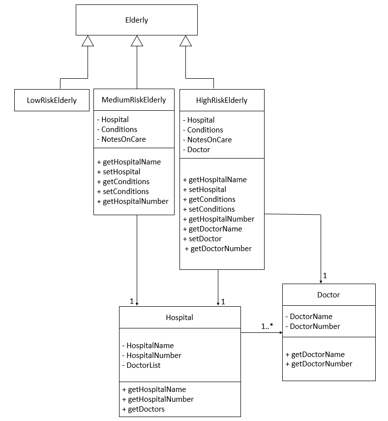

# Developer Guide

## Acknowledgements

{list here sources of all reused/adapted ideas, code, documentation, and third-party libraries -- include links to the original source as well}

## Design & implementation

{Describe the design and implementation of the product. Use UML diagrams and short code snippets where applicable.}

### Elderly risk categorisation
#### Implementation
The elderly risk categorisation is an addition to the current `Elderly` class. It utilises
**polymorphism**, creating three subclasses `LowRiskElderly`, `MediumRiskElderly`, `HighRiskElderly`,
all of which **inherits** from the `Elderly` class.  
Additionally, 2 new classes are implemented:
- `Hospital` — A class that contains information about a hospital, and contains a list of 
all its doctors. 
- `Doctor` — A class that contains information about a doctor

Below is a UML class diagram for the elderly risk categorisation:

#### How the classes interact with each other

`LowRiskElderly`, `MediumRiskElderly` and `HighRiskElderly` are expected to contain all current 
attributes and methods that `Elderly` class is supposed to have. 

In addition, `MediumRiskElderly` and `HighRiskElderly` are tagged with extra information,
specifically `Hospital`, `Conditions` and `NotesOnCare`. `Conditions` is an array string that 
contains all the conditions the elderly has, while `NotesOnCare` is just a string that sequentially
lists tips to care for elderly. Each elderly here is tagged to 1 `Hospital`.

Finally, `HighRiskElderly` is also tagged with `Doctor`. Each elderly here is tagged to 1 `Doctor`.

Every `Hospital` has 1 or more `Doctor`, stored in an ArrayList of type `Doctor`. 

#### Design considerations

Since our TP is only intended for one user (i.e. the caretaker in the elderly home), the input of 
`Hospital` and `Doctor` data should not be done by them. As such, we have made it such that they are
preset. `Hospital` and `Doctor` data are made to be fixed, as we make the assumption that the
`Hospital` and `Doctor` that the `MediumRiskElderly` and `HighRiskElderly` are looking for 
are already there. 

## Product scope
Hi, welcome to the Elderly in Your Hood.
It is a product to empower service personnel to 
store information about the elderly they are servicing in the elderly home.

### Target user profile
It is for service staffs at the elderly home who works at a PC,
prefers typing, and wants to avoid the tedious tracking of details of each and every
elderly they are servicing.

{Describe the target user profile}

### Value proposition

{Describe the value proposition: what problem does it solve?}

## User Stories

|Version| As a ... | I want to ... | So that I can ...|
|--------|----------|---------------|------------------|
|v1.0|new user|see usage instructions|refer to them when I forget how to use the application|
|v2.0|user|find a to-do item by name|locate a to-do without having to go through the entire list|

## Non-Functional Requirements

{Give non-functional requirements}
1. The product is not required to ensure that the dosage of medicine keyed are safe.
2. The product should work on both 32-bit and 64-bit system.

## Glossary

* *glossary item* - Definition

## Instructions for manual testing

{Give instructions on how to do a manual product testing e.g., how to load sample data to be used for testing}
