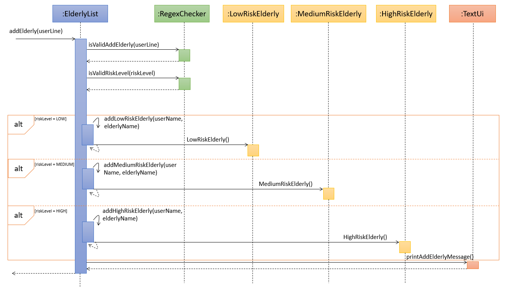
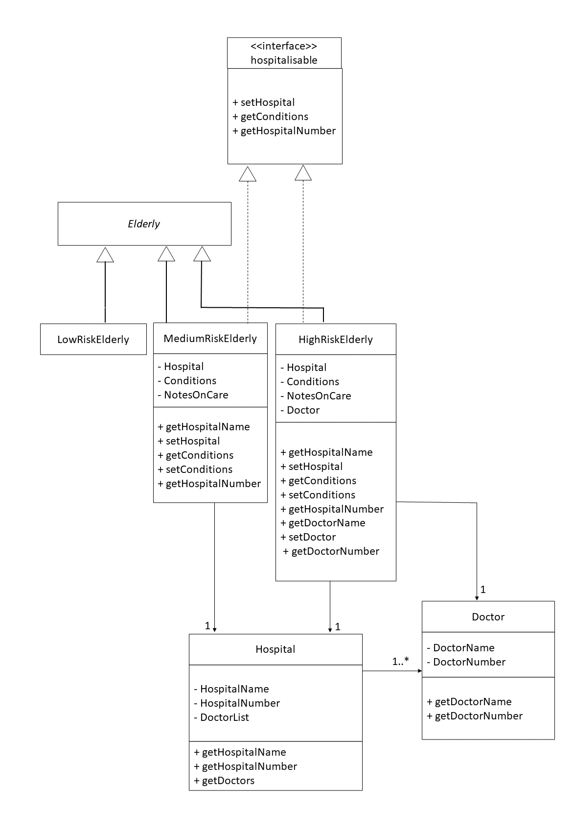

# Developer Guide

## Table of contents

- [Developer's Guide](#developer-guide)
  - [Product scope](#product-scope)
    - [Target user profile](#target-user-profile)
    - [Value proposition](#value-proposition)
  - [Design & Implementation](#design--implementation)
    - [Addition of Elderly](#addition-of-elderly)
    - [Elderly risk categorisation](#elderly-risk-categorisation)
    - [Addition of Next-of-Kin and Record Classes](#addition-of-next-of-kin-and-record-classes)
    - [Creation of New Objects Stored in ElderlyList Class](#creation-of-new-objects-stored-in-elderlylist-class)
    - [Deletion of Objects Stored in ElderlyList Class](#deletion-of-objects-stored-in-elderlylist-class)
    - [Autosuggestions for search functions](#autosuggestions-for-search-functions)
  - [User Stories](#user-stories)
  - [Non-Functional Requirements](#non-functional-requirements)
  - [Instructions for manual testing](#instructions-for-manual-testing)

## Product scope
Hi, welcome to the Elderly in Your Hood.
This is a product that has been developed in order to empower service personnel. Service personnel now have a convenient
and organised method to store information about the elderly they are assisting in an elderly home.

### Target user profile
It is for service staffs at the elderly home who works at a PC,
prefers typing, and wants to avoid the tedious tracking of details of each and every
elderly they are assisting.

<div style="page-break-after: always;"></div>

### Value proposition

Helpers in elderly care homes are often flooded with information. Different elderly has different conditions, and require so many
methods of care. Traditionally, information are stored as hardcopy in the forms of placards are information books.
However, with our program, we plan to centralise the different information each elderly has, and allow the helper, a fast typer,
to add and retrieve elderly information with ease. This increases productivity.

## Design & implementation

### Addition of Elderly
#### Implementation
Before the user can do anything, he has to first add some elderly into the system *(Details of
`addelderly` function is in UG)*. We created a `ElderlyList` class to handle the addition of `elderly`,
and a `RegexChecker` class to check for validity of the input. Various `elderly` subclasses are added
as well. *(Further explained in Elderly Risk Categorisation)*

Below is a UML sequence diagram for the process of addition of elderly:



<div style="page-break-after: always;"></div>

#### How the classes interact with each other

1. `addElderly()` in the class `ElderlyList` is run, supplied with the input `userline`, and methods from the `TextUi
   class will interact with the `userLine`
2. Regex checks from `RegexChecker` class `isValidAddElderly()` and `isValidRiskLevel()` are run in order to check
   if the inputs in the `userLine` are valid
3. Depending on the `riskLevel`, `elderly` is added into respective subclasses *(Further explained in Elderly
   Risk Categorisation)*
4. Message to notify the users that the elderly has been added is printed via `TextUi`


### Elderly risk categorisation
#### Implementation
The elderly risk categorisation is an addition to the current abstract `Elderly` class. It utilises
**polymorphism**, creating three subclasses `LowRiskElderly`, `MediumRiskElderly`, `HighRiskElderly`,
all of which **inherits** from the abstract `Elderly` class. In addition, to achieve better **encapsulation**,
fields in each of the class are declared as `private`.<br>
Since the `MediumRiskElderly` and `HighRiskElderly` needs to receive hospitalisation at appropriate timing,
they are implemented with the interface `Hospitalisable` where its assigned hospital, medical conditions
as well as special notes to take care of them can be returned via the methods in the interface.

Additionally, 2 new classes are implemented:
- `Hospital` — A class that contains information about a hospital, and contains a list of
  all its doctors.
- `Doctor` — A class that contains information about a doctor


Below is a UML class diagram for the elderly risk categorisation:



#### How the classes interact with each other

`LowRiskElderly`, `MediumRiskElderly` and `HighRiskElderly` are expected to contain all current
attributes and methods that `Elderly` class is supposed to have.

In addition, `MediumRiskElderly` and `HighRiskElderly` are tagged with extra information,
specifically `Hospital`, `Conditions` and `NotesOnCare`. `Conditions` is an array string that
contains all the conditions the elderly has, while `NotesOnCare` is just a string that sequentially
lists tips to care for elderly. Each elderly here is tagged to 1 `Hospital`.

Finally, `HighRiskElderly` is also tagged with `Doctor`. Each elderly here is tagged to 1 `Doctor`.

Every `Hospital` has 1 or more `Doctor`, stored in an ArrayList of type `Doctor`.

#### Design considerations

Since our TP is only intended for one user (i.e. the caretaker in the elderly home), the input of
`Hospital` and `Doctor` data should not be done by them. As such, we have made it such that they are
preset. `Hospital` and `Doctor` data are made to be fixed, as we make the assumption that the
`Hospital` and `Doctor` that the `MediumRiskElderly` and `HighRiskElderly` are looking for
are already there.


### Addition of Next-of-Kin and Record Classes
#### Implementation

The `Elderly` class interacts with two classes, which is `Next-of-Kin` class and `Record` class. As can
be seen by the association between the three classes, the `Elderly` class stores `Next-of-Kin` and `Record`
as ArrayLists in its attributes.
- `Next-of-Kin` class stores the contact information of the Next-of-Kin, such as name, phone number,
  email, address and relationship to the Elderly
- `Record` stores the details of the Elderly, such as the elderly phone number and address


This information in both classes is then stored in `Elderly` class.

<div style="page-break-after: always;"></div>

UML Diagram of the interaction between classes is shown below:


#### Interaction of Classes
`Elderly` class will interact with `Next-of-kin` class through the use of `addNok()` function. This function will

add and store the Next-of-Kin information into the given elderly. It is possible to store more than
one Next-of-Kin information per elderly, as the information will all be stored in an Array List. This is to
cater to the possibility that the elderly has more than one point of contact. Multiple points of contact is also
extremely useful for the user as it increases the possibility to reach an emergency contact and
ensure a higher sense of security for the elderly.
This Next-of-Kin information can be retrieved at any point by using the `viewNok()` function.


`Elderly` class also interacts with the `Next-of-Kin` class through the use of `removeNok()` function. This function
deletes the particular Next-of-Kin information stored in the `Elderly` class, as specified by the user. The Array List
will no longer reflect the deleted Next-of-Kin information, likewise `viewNok()` will not have this information stored as well.


Interaction of the `Record` class is also similar to the previous interaction. However, the elderly information is
now stored instead. Similarly, `addRecord()` function is called to store the details of the elderly and `viewRecord()`
is used to view the details that are stored.

<div style="page-break-after: always;"></div>

#### Future Implementation and Considerations

`removeRecord()` function has not been implemented yet as it is deemed to be **not critical** in this current phase.
However, it is a large possibility that the elderly would have a change in their phone number and address. In this current
implementation, it is **still possible** for the user to input the new details, as the details are stored in an Array List.
However, it is not the most ideal solution as there might be too many details which can be confusing for the user.
Moreover, there is no indication to show which is the current details that is accurate. Hence, this function should be
implemented in the future to help improve the usability and convenience of the overall user experience.

### Creation of New Objects Stored in ElderlyList Class
#### Design and Implementation

Below is the Sequence Diagram for creating new objects which will be stored in `ElderlyList` Class:


<div style="page-break-after: always;"></div>

### Deletion of Objects Stored in ElderlyList Class
#### Design and Implementation

Below is the Sequence Diagram for deletion of objects which are stored in `ElderlyList` Class:


### Autosuggestions for search functions
#### Problems Faced
For fast typers, they may **misspell words** and are somehow convinced that their spelling is correct.
Furthermore, as our program mainly deals with usernames, medicine names, etc., they may be cryptic
and **difficult to remember**.

#### Solution to said problems
We opted to have an autosuggestion function that will look for the
closest possible search result in the store of the program.

#### Details of solution
We used a concept known as [Levenshtein Distance](https://medium.com/@ethannam/understanding-the-levenshtein-distance-equation-for-beginners-c4285a5604f0)
to check the similarities between 2 strings.

For brevity, I will attempt to explain the concept here. In essence, it checks what are the number
of edits made at position `i` of 2 strings. This can be better illustrated with an example.

Given that we have a medicine `panadol` in the system and a misspelt user query of `parasol`.
Assuming we have `i` as the iterator for `panadol` and `j` as the iterator of `parasol`. At position
`i=3` and `j=3`, there is a change of 1 character from `n->r` so `lev_i,j(3,3) = 1` as 1 edit is
required. At `lev_i,j(7,7)`, there would have been a total of 2 characters changed.


<p align = center>Image of Levenshtein Distance Function</p>

The function above is applied to both strings and its results are compounded. We then take a **ratio
of the number of unchanged characters over the total number of characters in both strings** to
determine how similar the 2 strings are.

#### How is it applied to the program?
When using the `findbymed`, `findbydiet`, `findbyname` functions, they will take generate a set of
medicine, diets and real names respectively. The function `checkSimilarities` in `ElderlyList.class`
will then iterate through each item in the set and compare it with the query term. If there is a
similarity score of `>=0.8`, the closest match will be printed.

#### How did you determine that the magic similarity value to be used is 0.8?
It was through vigorous trial and testing that 0.8 seems like the most appropriate value.

#### An example of AutoSuggestions
Assuming we have an elderly that exist in the system called `John Tan`. We, as the user, remember
that his name was `<SOMETHING> Tan`, and it was either `Josh` or `John`. We try `Josh`
first.


Instead of just prompting that the system could not find `Josh Tan`, the search term went through
the Levenshtein Distance logic and the name `John Tan` returned with a result of `0.9375`. As you
can see, this was our intended result and showcases the intended solution to our problem.

#### Potential Shortcomings of this function
There may be two strings that have similar edit distance to each other but may not be related to
each other. This will include words like `sitting` and `kitten` for example. This may give
inaccurate suggestions. However, since this is **not a key function** and is only meant to be a
complementary tool, **it will not be a major problem**.


## Appendix A: Product Scope
### Target user profile
Caregivers who are fast typists and prefer Command Line Interface(CLI) for their duties.

### Value proposition
* Easily manage patient information
* Easily manage patient schedules and appointments


## Appendix B: User Stories

|Version| As a ... | I want to ... | So that I can ...|
|--------|----------|---------------|------------------|
|v1.0|helper|add elderly| keep track of the list of all elderly|
|v1.0|helper|store hospital appointment dates|keep track of all hospital appointment dates for each elderly|
|v1.0|helper|view hospital appointment dates|view all the hospital appointment dates for each elderly|
|v1.0|helper|store elderly medicine types|keep track of the medicine for each elderly|
|v1.0|helper|view elderly medicine types|ensure that the elderly will take the right medicine on time|
|v2.0|helper|categorise elderly by risk their levels|pay more attention to elderly of higher risk|
|v2.0|helper|add hospital information to medium and high risk elderly|store hospital information specific to the elderly|
|v2.0|helper|view hospital information to medium and high risk elderly|utilise hospital information during emergency|
|v2.0|helper|add medical history|keep track of all the medical history of the elderly|
|v2.0|helper|view medical history|view of all the medical history of the elderly when it is needed (such as bringing the elderly for a health check-up)|
|v2.0|helper|add conditions of medium and high risk elderly|keep track of conditions specific to the elderly|
|v2.0|helper|view conditions of medium and high risk elderly|view the conditions of the elderly|
|v2.0|helper|add notes on care of medium and high risk elderly|enable other helpers can render assistance specific to the elderly|
|v2.0|helper|view notes on care of medium and high risk elderly|take notes on how to care for the elderly|
|v2.0|helper|add doctor information to high risk elderly|store doctor information specific to the elderly|
|v2.0|helper|view doctor information to high risk elderly|utilise doctor information during emergency|


## Appendix C: Non-Functional Requirements

1. Should work on any _mainstream OS_ as long as it has `Java 11` or above installed.
2. The product is not required to ensure that the dosage of medicine keyed are safe.
3. The product should work on both 32-bit and 64-bit system.
4. This version of product does not allow users to manually add additional hospital and doctors.

## Appendix D: Glossary
* _Mainstream OS_ - Windows, Linux, Unix, OS-X

## Appendix E: Instructions for manual testing

Given below are instructions to test the app manually.

### Launch and shutdown
1. Initial launch 
   1. Download the jar file and copy into working directory
   2. Launch it with `java -jar ElderlyInTheHood.jar`

2. Shutdown of program
   1. Launch the `bye` command to exit

### Saving and Loading Data
Data from the current running instance of the program can be stored in persistent storage.
It will save to the filename specified by the user in the local directory. 
While program is being run, run `load fp/[FILENAME.json]`

Note: Filename can only consist of characters and must end with `.json`.
View [User Guide](https://ay2122s1-cs2113-t16-2.github.io/tp/UserGuide.html) for more information.

Data can be restored from the file specified. 

#### Storing into wrong file location
Test Case: Storing into a file that you are unable to write to
1. On your system, traverse to a place you cannot write to. 
2. Copy the JAR file there. 
3. Run the program and run `store fp/data.json`
4. Expected output:
   ```
   data.json (Access is denied)
   ```

#### Dealing with corrupted data files
Test Case 1: Loading from file, a user with an invalid appointment date `32132021`
      
1. Create a file data.json in the local directory with the following contents
```json
[
  {
    "medicines": [],
    "appointments": [],
    "nextofkins": [],
    "records": [],
    "username": "nguyin",
    "name": "rebecca ng",
    "bloodPressure": [
      -1,
      -1
    ],
    "isVaccinated": false,
    "diet": "NOT_SET",
    "medicalHistory": "",
    "type": "seedu.duke.common.LowRiskElderly"
  },
  {
    "medicines": [],
    "appointments": [
      {
        "location": "khoo teck puat hospital",
        "date": "32132021",
        "time": "0900",
        "purpose": "general checkup"
      }
    ],
    "nextofkins": [],
    "records": [],
    "username": "owinsoh",
    "name": "owen soh",
    "bloodPressure": [
      -1,
      -1
    ],
    "isVaccinated": false,
    "diet": "NOT_SET",
    "medicalHistory": "",
    "type": "seedu.duke.common.LowRiskElderly"
  }
]
```
2. In the running instance of the program, call `load fp/data.json`.
This is the expected result:
```
[*] data.json exists. Loading from file!
[!] owinsoh object has issue!
[!] File is in the wrong format, could not load!
```   
3. Rectify the error, and load again. The `load` command will not successfully load unless the file is in the format

Test Case 2: Loading from file, a user with a different type `Integer` instead of `String`
1. Create a file data.json in the local directory with the following contents
```json
[
  {
    "medicines": [],
    "appointments": [],
    "nextofkins": [],
    "records": [],
    "username": "nguyin",
    "name": "rebecca ng",
    "bloodPressure": [
      -1,
      -1
    ],
    "isVaccinated": false,
    "diet": 123,
    "medicalHistory": "",
    "type": "seedu.duke.common.LowRiskElderly"
  },
  {
    "medicines": [],
    "appointments": [
      {
        "location": "khoo teck puat hospital",
        "date": "31122021",
        "time": "0900",
        "purpose": "general checkup"
      }
    ],
    "nextofkins": [],
    "records": [],
    "username": "owinsoh",
    "name": "owen soh",
    "bloodPressure": [
      -1,
      -1
    ],
    "isVaccinated": false,
    "diet": "NOT_SET",
    "medicalHistory": "",
    "type": "seedu.duke.common.LowRiskElderly"
  }
]
```
2. In the running instance of the program, call `load fp/data.json`.
   This is the expected result:
```
[*] data.json exists. Loading from file!
[!] File is in the wrong format, could not load!
```   

#### Loading from a file in the correct format
Test Case: Loading from a file with the correct format
1. Create a file data.json in the local directory with the following contents
```json
[
  {
    "medicines": [],
    "appointments": [],
    "nextofkins": [],
    "records": [],
    "username": "nguyin",
    "name": "rebecca ng",
    "bloodPressure": [
      -1,
      -1
    ],
    "isVaccinated": false,
    "diet": "NOT_SET",
    "medicalHistory": "",
    "type": "seedu.duke.common.LowRiskElderly"
  },
  {
    "medicines": [],
    "appointments": [
      {
        "location": "khoo teck puat hospital",
        "date": "31122021",
        "time": "0900",
        "purpose": "general checkup"
      }
    ],
    "nextofkins": [],
    "records": [],
    "username": "owinsoh",
    "name": "owen soh",
    "bloodPressure": [
      -1,
      -1
    ],
    "isVaccinated": false,
    "diet": "NOT_SET",
    "medicalHistory": "",
    "type": "seedu.duke.common.LowRiskElderly"
  }
]
```
2. In the running instance of the program, call `load fp/data.json`.
   This is the expected result:```[*] data1.json exists. Loading from file!```

### Viewing birthdays
Birthdays that has been added to an elderly can be viewed.
While program is being run, run `viewbirthday u/USER_NAME`

View [UG-viewbirthday](https://ay2122s1-cs2113-t16-2.github.io/tp/UserGuide.html#view-birthday-viewbirthday) for more information.


#### Viewing from invalid username
Test Case: Viewing birthday of a non-existent username
1. On the program, attempt to view birthday of non-existent username
   ```
   > viewbirthday u/random_username
    Invalid input detected
    Correct input format: viewbirthday u/USER_NAME
   ```

#### Viewing from valid username, but birthday has not been set
Test Case: Viewing birthday of an existent username, but birthday has not been set
1. On the program, attempt to view birthday of existent username, but birthday not set
   ```
   > viewbirthday u/hotchic31
    Birthday of owen soh has not been set.
   ```

#### Viewing from valid username and birthday has been set
Test Case: Viewing birthday of an existent username, but birthday has been set
1. On the program, attempt to view birthday of existent username, and birthday is set
   ```
   > viewbirthday u/rheng
    Birthday of rachel heng is 1977-09-22
   ```

### Viewing vaccination status
Vaccination status of elderly can be viewed.
While program is being run, run `viewvaccination u/USER_NAME`

Note: We assume that an elderly has not been vaccinated yet if he/she is not recorded as vaccinated in the system.
View [UG-viewvaccination](https://ay2122s1-cs2113-t16-2.github.io/tp/UserGuide.html#view-vaccination-status-viewvaccination) for more information.


#### Viewing from invalid username
Test Case: Viewing vaccination status of a non-existent username
1. On the program, attempt to view vaccination status of non-existent username
   ```
   > viewvaccination u/random_username
    Invalid input detected
    Correct input format: [!] Correct viewvaccination input: viewvaccination u/USER_NAME
    [!] Elderly name you have keyed in does not exist
   ```

#### Viewing from valid username, but vaccination status has not been changed
Test Case: Viewing vaccination status of an existent username, but has not been changed
1. On the program, attempt to view vaccination status of existent username, but vaccination status not changed
   ```
   > viewvaccination u/hotchic31
    owen soh is currently not vaccinated.
   ```

#### Viewing from valid username and vaccination status has been changed
Test Case: Viewing vaccination status of an existent username, but has been changed
1. On the program, attempt to view vaccination status of existent username, and vaccination status is changed
   ```
   > viewvaccination u/rheng
    rachel heng is currently vaccinated.
   ```

### Viewing dietary preference
Dietary preference of elderly can be viewed.
While program is being run, run `viewdiet u/USER_NAME`

Note: Elderly diet defaulted to not set if elderly exists, but no diet has been set
View [UG-viewdiet](https://ay2122s1-cs2113-t16-2.github.io/tp/UserGuide.html#view-dietary-preference-viewdiet) for more information.


#### Viewing from invalid username
Test Case: Viewing dietary preference of a non-existent username
1. On the program, attempt to view dietary preference of non-existent username
   ```
   > viewdiet u/random_username
    Invalid input detected
    Correct input format: [!] Correct viewdiet input: viewdiet u/USER_NAME.
    [!] Elderly name you have keyed in does not exist
   ```

#### Viewing from valid username, but dietary preference has not been set
Test Case: Viewing dietary preference of an existent username, but has not been set
1. On the program, attempt to view dietary preference of existent username, but dietary preference not set
   ```
   > viewdiet u/hotchic31
    Dietary preference of owen soh has not been set
   ```

#### Viewing from valid username and dietary preference has been set
Test Case: Viewing dietary preference of an existent username, but has been changed
1. On the program, attempt to view dietary preference of existent username, and dietary preference is set
   ```
   > viewdiet u/rheng
    rachel heng is having a Vegan diet
   ```

### Viewing blood pressure
Blood pressure of elderly can be viewed.
While program is being run, run `viewbloodpressure u/USER_NAME`

Note: Elderly blood pressure defaulted to not set
View [UG-viewbloodpressure](https://ay2122s1-cs2113-t16-2.github.io/tp/UserGuide.html#view-blood-pressure-viewbloodpressure) for more information.


#### Viewing from invalid username
Test Case: Viewing blood pressure of a non-existent username
1. On the program, attempt to view blood pressure of non-existent username
   ```
   > viewbloodpressure u/random_username
    [!] Elderly name you have keyed in does not exist
   ```

#### Viewing from valid username, but blood pressure has not been set
Test Case: Viewing blood pressure of an existent username, but has not been set
1. On the program, attempt to view blood pressure of existent username, but blood pressure not set
   ```
   > viewbloodpressure u/hotchic31
    [*] Blood pressure of owen soh has not yet been set!
   ```

#### Viewing from valid username and dietary preference has been set
Test Case: Viewing blood pressure of an existent username, but has been changed
1. On the program, attempt to view blood pressure of existent username, and blood pressure is set
   ```
   > viewbloodpressure u/rheng
    Blood pressure of rachel heng is now (92 107)
   ```

### List 
The information of all elderly can be listed down
While program is being run, run `list`

View [UG-list](https://ay2122s1-cs2113-t16-2.github.io/tp/UserGuide.html#list-all-elderly-in-the-system-list) for more information.


#### Listing when elderly has not been added
Test Case: Listing elderly in system when none have been added
1. On the program, attempt to list all elderly
   ```
   > list
    [*] There are currently 0 elderly registered in the system
   ```

#### Listing when elderly has been added 
Test Case: Listing elderly in system when some have been added
1. On the program, attempt to list all elderly
   ```
   > list
    [*] There are currently 2 elderly registered in the system
    [*] Risk Level : HIGH
    [*] Elderly Username: johntan123
    [*] Elderly Name: John Tan
    [*] Vaccination status of johntan123: Vaccinated
    Blood pressure of John Tan is now (120 80)
    
    [*] Birthday of johntan123: 1959-10-29
    [*] Here are johntan123's records:
    Elderly HP: 87778374, Elderly Address: Blk 2 College Drive
    
    [*] Here is the list of upcoming appointments:
    Location: khoo teck puat hospital, Date: 02012021, Time: 1000, Purpose of Visit: general checkup
    Location: khoo teck puat hospital, Date: 05032021, Time: 1500, Purpose of Visit: eye checkup
    
    [*] This is the list of medicine(s):
    Medicine Name: paracetamol, Frequency: once a day
    
    [*] These are NOK(s) attached to johntan123:
    NOK Name: peter tan, NOK HP: 98733842, NOK Email: hello-world@gmail.com, NOK Address: Blk 2 College Drive, Relationship: Father
    
    [*] Hospital Details :
    khoo teck puat hospital (Hospital Name)
    65558000 (Hospital Number)
    
    [*] Conditions of elderly johntan123 : amnesia, stage 2 liver cancer, lower body paralysis
    
    [*] Doctor for johntan123 :
    adrian vergil (Doctor Name)
    88129931 (Doctor Number)
    
    [*] Notes on care for johntan123 : at least 3 nurses required to ensure safety when showering. needs daily routine of going on walks at 7am. remember to lock wheelchair when stationary. meals should only be given during mealtimes to prevent overconsumption. reduce salt in food. liver checks to be done every sunday 3pm.
    
    [*] Risk Level : LOW
    [*] Elderly Username: owintoh456
    [*] Elderly Name: Owin Toh
    [*] Vaccination status of owintoh456: Not vaccinated
    [*] Blood pressure of Owin Toh has not yet been set!
    
    [*] Birthday of owintoh456: Not Recorded
    [*] Here are owintoh456's records:
    
    
    [*] Here is the list of upcoming appointments:
    
    
    [*] This is the list of medicine(s):
    
    
    [*] These are NOK(s) attached to owintoh456:
   ```

### Help
The list of all commands can be shown
While program is being run, run `help`

Notes: Commands shown in help screen are split up based on the command type
View [UG-help](https://ay2122s1-cs2113-t16-2.github.io/tp/UserGuide.html#show-help-menu-help) for more information.


#### Running help
Test Case: Listing all commands that can be run by the user
1. On the program, use help command
   ```
   > help

    [*] The following is a list of commands:
    Misc. Commands
    
    list - List all elderly in the program
    help - Prints this help menu
    bye - Quits Program
    
    Creation Commands
    
    [*] Add Elderly format: addelderly u/USERNAME n/NAME r/RISK_LEVEL
    [*] Add Medicine format: addmed u/USERNAME m/MEDICINE_NAME f/FREQUENCY
    [*] Add Appointment format: addappt u/USERNAME l/LOCATION d/DATE t/TIME p/[PURPOSE]
    [*] Add Next-Of-Kin information format: addnok u/USERNAME k/NOKNAME p/NOKPHONE e/NOKEMAIL a/NOKADDR r/NOKRSHIP
    [*] Add Elderly Record Information format: addrec u/USERNAME p/PHONENUMBER a/HOMEADDRESS
    [*] Add Medical History format: addmedicalhistory u/USERNAME
    [*] Set Birthday format: setbirthday u/USERNAME b/BIRTHDAY
    [*] Set Vaccination format: setvaccination u/USERNAME
    [*] Set Diet format: setdiet u/USERNAME
    [*] Set Blood Pressure format: setbloodpressure u/USERNAME s/SYSTOLIC_PRESSURE d/DIATOLIC_PRESSURE
    
    Reading Commands
    
    [*] View Medicine format: viewmed u/USERNAME
    [*] View Appointment format: viewappt u/USERNAME
    [*] View Next-Of-Kin format: viewnok u/USERNAME
    [*] View Elderly Record Information format: viewrec u/USERNAME
    [*] View Medical History format: viewmedicalhistory u/USERNAME
    [*] View Birthday format: viewbirthday u/USERNAME
    [*] View Vaccination format: viewvaccination u/USERNAME
    [*] View Diet format: viewdiet u/USERNAME
    [*] View Blood Pressure format: viewbloodpressure u/USERNAME
    
    Filter Commands
    
    [*] Find By Medicine format: findbymed m/MEDICINE_NAME
    [*] Find By Diet format: findbydiet d/DIET
    [*] Find By Name format: findbyname n/NAME
    
    Delete Commands
    
    [*] Delete format: deleteelderly u/USERNAME
    [*] Delete medicine format: deletemed u/USERNAME m/MEDICINE_NAME
    [*] Delete appointment format: deleteappt u/USERNAME d/DATE t/TIME
    [*] Delete Next-Of-Kin information format: deletenok u/USERNAME n/NOKNAME
    [*] Delete medical history format: deletemedicalhistory u/USERNAME
    
    File I/O Commands
    
    [*] Store format: store fp/FILE
    [*] Load format: load fp/FILE
   ```

### Bye
Program termination
While program is being run, run `bye`

Notes: Elderly inputs are not automatically saved after `bye` is run. Check out `store` command.
View [UG-bye](https://ay2122s1-cs2113-t16-2.github.io/tp/UserGuide.html#terminating-bye) for more information.


#### Running bye
Test Case: Terminating program
1. On the program, use bye command
   ```
   > bye
    [*] Bye command has been recognized. Goodbye!
   ```

### Finding elderly by medicine
Elderly can be found based on medicine taken.
While program is being run, run `findbymed m/MEDICINE_NAME`

View [UG-findbymed](https://ay2122s1-cs2113-t16-2.github.io/tp/UserGuide.html#find-which-elderly-is-taking-what-medication-findbymed) for more information.


#### Finding with medicine name that nobody has
Test Case: Finding elderly by medicine, but none of the elderly takes the given medicine
1. On the program, attempt to find elderly by medicine with a random medicine name
   ```
   > findbymed m/abacavir
    [*] This is the results for the following query: abacavir
    [!] I cannot find abacavir
   ```

#### Finding with medicine name that at least an elderly has
Test Case: Finding elderly by medicine, and 2 of the elderly takes the given medicine
1. On the program, attempt to find elderly by medicine with a medicine name that they take
   ```
   > findbymed m/paracetemol
    [*] This is the results for the following query: paracetemol
    wutdequack
    hotchic31
   ```
   
### Finding elderly by diet
Elderly can be found based on diet taken.
While program is being run, run `findbydiet d/DIET`

Note: There are fixed diet to be chosen from when setting diet. Hence, weird diet names will just be taken at face value and will not produce useful results.
View [UG-findbydiet](https://ay2122s1-cs2113-t16-2.github.io/tp/UserGuide.html#find-which-elderly-is-on-what-kind-of-diet-findbydiet) for more information.


#### Finding with diet that nobody has
Test Case: Finding elderly by diet, but none of the elderly has the given diet
1. On the program, attempt to find elderly by diet with a diet that nobody takes
   ```
   > findbydiet d/chicken only
    [*] This is the results for the following query: chicken only
    [!] I cannot find chicken only
   ```

#### Finding with diet that at least an elderly has
Test Case: Finding elderly by diet, and 2 of the elderly has the given diet
1. On the program, attempt to find elderly by diet with a diet that they take
   ```
   > findbydiet d/beef free
    [*] This is the results for the following query: beef free
    owinsoh
    rtay
   ```

### Finding elderly by name
Elderly can be found based on name.
While program is being run, run `findbyname n/NAME`

Note: If there are elderly with the same name, both instances will be printed out
View [UG-findbyname](https://ay2122s1-cs2113-t16-2.github.io/tp/UserGuide.html#find-elderly-details-given-their-name-findbyname) for more information.


#### Finding with name that nobody has
Test Case: Finding elderly by name, but none of the elderly has the given name
1. On the program, attempt to find elderly by name with a name that nobody has
   ```
   > findbyname n/lim qing qing
    [*] This is the results for the following query: lim qing qing
    [!] I cannot find lim qing qing
   ```

#### Finding with name that at least an elderly has
Test Case: Finding elderly by name, and 1 of the name has the given name
1. On the program, attempt to find elderly by name, where someone has given name
   ```
   > findbyname n/jonathan lee
    [*] This is the results for the following query: jonathan lee
    [*] Risk Level : HIGH
    [*] Elderly Username: wutdequack
    [*] Elderly Name: jonathan lee
    [*] Diet Preference of wutdequack: No restriction
    [*] Vaccination status of wutdequack: Not vaccinated
    [*] Blood pressure of jonathan lee is now (60 70)
    [*] Birthday of wutdequack: 1959-02-01
    [*] Medical History: Heart Disease
    [*] Here are wutdequack's records:
    Elderly HP: 88883823, Elderly Address: Blk 10 Some Road
    
    [*] Here is the list of upcoming appointments:
    Location: ng teng fong general hospital, Date: 20112021, Time: 1130, Purpose of Visit: routine checkup
    
    [*] This is the list of medicine(s):
    Medicine Name: paracetemol, Frequency: daily
    
    [*] These are NOK(s) attached to wutdequack:
    NOK Name: Pita Lee, NOK HP: 91898372, NOK Email: gg@gg.com, NOK Address: Blk 10 Some Road, Relationship: Cousin
    
    [*] Hospital Details :
    national university hospital (Hospital Name)
    67795555 (Hospital Number)
    
    [*] Conditions of elderly wutdequack : strong migraines. Currently has concussion
    
    [*] Doctor for wutdequack :
    juan chelsie (Doctor Name)
    97915260 (Doctor Number)
    
    [*] Notes on care for wutdequack : Doctor to monitor status upon routine check ups
   ```

### Deleting elderly from records
Elderly record can be deleted.
While program is being run, run `deleteelderly u/USERNAME`

View [UG-deleteelderly](https://ay2122s1-cs2113-t16-2.github.io/tp/UserGuide.html#delete-elderly-from-system-given-username-deleteelderly) for more information.


#### Deleting an elderly record but username not in system
Test Case: Deleting elderly record, but username is not in system
1. On the program, attempt to delete elderly, but with non-existent username
   ```
   > deleteelderly u/superman123
    [!] I cannot find superman123
   ```

#### Deleting an elderly record and username is in system
Test Case: Deleting elderly record, and username is in system
1. On the program, attempt to delete elderly, but with existent username
   ```
   > deleteelderly u/wutdequack
    [*] wutdequack has been deleted.
   ```

### Deleting elderly medicine from records
Medicine record from given elderly can be deleted.
While program is being run, run `deletemed u/USERNAME m/MEDICINE_NAME`

View [UG-deletemed](https://ay2122s1-cs2113-t16-2.github.io/tp/UserGuide.html#delete-medicine-from-elderly-deletemed) for more information.

#### Deleting a medicine record from non-existent elderly
Test Case: Deleting medicine record, but elderly username is not in system
1. On the program, attempt to delete medicine, but with non-existent username
   ```
   > deletemed u/username1234 m/paracetemol
    [!] Elderly name you have keyed in does not exist
   ```

#### Deleting a medicine record from existent elderly but medicine name not in system
Test Case: Deleting medicine record that does not exist, but elderly username exists
1. On the program, attempt to delete non-existent medicine from existing elderly
   ```
   > deletemed u/rheng m/abacavir
    No Medicine found
   ```

#### Deleting an existing medicine record from existent elderly
Test Case: Deleting existing medicine record from existing elderly
1. On the program, attempt to delete medicine record from given elderly
   ```
   > deletemed u/rheng m/panadol
    These medicine details are now deleted:
    Medicine Name: panadol, Frequency: 3 times a day
   ```

### Deleting elderly appointment from records
Appointment record from given elderly can be deleted.
While program is being run, run `deleteappt u/USERNAME d/DATE t/TIME`

Note: Error checking for datetime has already been done when adding appointment, hence we do not provide an indifferent error message when invalid datetime is shown.
View [UG-deleteappt](https://ay2122s1-cs2113-t16-2.github.io/tp/UserGuide.html#delete-appointment-from-elderly-deleteappt) for more information.

#### Deleting an appointment record from non-existent elderly
Test Case: Deleting appointment record, but elderly username is not in system
1. On the program, attempt to delete appointment, but with non-existent username
   ```
   > deleteappt u/username1234 d/09092021 t/0900
    [!] Elderly name you have keyed in does not exist
   ```

#### Deleting an appointment record from existent elderly but appointment details not in system
Test Case: Deleting appointment record that does not exist, but elderly username exists
1. On the program, attempt to delete non-existent appointment from existing elderly
   ```
   > deleteappt u/rheng d/09092021 t/0900
    No Appointment found
   ```

#### Deleting an appointment record from existent elderly but invalid datetime given
Test Case: Deleting appointment record that has incorrect datetime format, but elderly username exists
1. On the program, attempt to delete non-existent appointment from existing elderly
   ```
   deleteappt u/rheng d/09092021 t/2500
    No Appointment found
   ```

#### Deleting an existing appointment record from existent elderly
Test Case: Deleting existing appointment record from existing elderly
1. On the program, attempt to delete appointment record from given elderly
   ```
   > deleteappt u/rheng d/06022022 t/1330
    These appointment details are now deleted:
    Location: singapore general hospital, Date: 06022022, Time: 1330, Purpose of Visit: general checkup
   ```

### Deleting elderly next of kin from records
Next of kin (nok) record from given elderly can be deleted.
While program is being run, run `deletenok u/USERNAME n/NOKNAME`

View [UG-deletenok](https://ay2122s1-cs2113-t16-2.github.io/tp/UserGuide.html#delete-next-of-kin-contact-from-elderly-deletenok) for more information.

#### Deleting a nok record from non-existent elderly
Test Case: Deleting nok record, but elderly username is not in system
1. On the program, attempt to delete nok, but with non-existent username
   ```
   > deletenok u/username1234 n/jack lee
    [!] Elderly name you have keyed in does not exist
   ```

#### Deleting a nok record from existent elderly but appointment details not in system
Test Case: Deleting nok record that does not exist, but elderly username exists
1. On the program, attempt to delete non-existent nok from existing elderly
   ```
   > deletenok u/rheng n/jack lee
    No Next-Of-Kin found
   ```

#### Deleting an existing nok record from existent elderly
Test Case: Deleting existing nok record from existing elderly
1. On the program, attempt to delete nok record from given elderly
   ```
   > deletenok u/rheng n/mina lee
    These details are now deleted:
    NOK Name: Mina Lee, NOK HP: 89273642, NOK Email: mlee@gmail.com, NOK Address: Blk 1 Lorong Chuan, Relationship: Friend
   ```

### Deleting elderly medical history from records
Medical history record from given elderly can be deleted.
While program is being run, run `deletemedicalhistory u/USERNAME`

View [UG-deletemedicalhistory](https://ay2122s1-cs2113-t16-2.github.io/tp/UserGuide.html#delete-previous-medication-history-information-from-elderly-deletemedicalhistory) for more information.

#### Deleting a medical history record from non-existent elderly
Test Case: Deleting medical history record, but elderly username is not in system
1. On the program, attempt to delete medical history, but with non-existent username
   ```
   > deletemedicalhistory u/username1234
    [!] Elderly name you have keyed in does not exist
   ```

#### Deleting an existing medical history record from existent elderly
Test Case: Deleting existing medical history record from existing elderly
1. On the program, attempt to delete medical history record from given elderly
   ```
   > deletemedicalhistory u/username1234
    [!] Elderly name you have keyed in does not exist
    > deletemedicalhistory u/rheng
    [*] Are you sure you want to delete the medical history of rachel heng? (Y/N)
    > Y
    [*] Medical history of rachel heng has been deleted
   ```
   