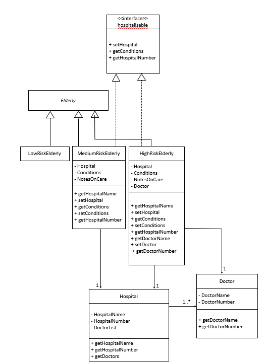
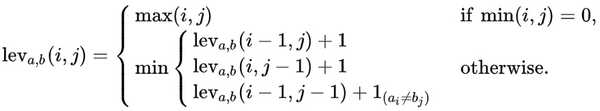
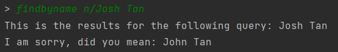

# Developer Guide

## Product scope
Hi, welcome to the Elderly in Your Hood.
This is a product that has been developed in order to empower service personnel. Service personnel now have a convenient
and organised method to store information about the elderly they are assisting in an elderly home.

### Target user profile
It is for service staffs at the elderly home who works at a PC,
prefers typing, and wants to avoid the tedious tracking of details of each and every
elderly they are assisting.

### Value proposition

Helpers in elderly care homes are often flooded with information. Different elderly has different conditions, and require so many
methods of care. Traditionally, information are stored as hardcopy in the forms of placards are information books.
However, with our program, we plan to centralise the different information each elderly has, and allow the helper, a fast typer,
to add and retrieve elderly information with ease. This increases productivity.

## Design & implementation

{Describe the design and implementation of the product. Use UML diagrams and short code snippets where applicable.}

### Addition of Next-of-Kin and Record Classes
#### Implementation

The `Elderly` class interacts with two classes, which is `Next-of-Kin` class and `Record` class. As can
be seen by the association between the three classes, the `Elderly` class stores `Next-of-Kin` and `Record`
as ArrayLists in its attributes.
- `Next-of-Kin` class stores the contact information of the Next-of-Kin, such as name, phone number,
  email, address and relationship to the Elderly
- `Record` stores the details of the Elderly, such as the elderly phone number and address

This information in both classes is then stored in `Elderly` class.

UML Diagram of the interaction between classes is shown below :

#### Interaction of Classes
`Elderly` class will interact with `Next-of-kin` class through the use of `addNok()` function. This function will

add and store the Next-of-Kin information into the given elderly. It is possible to store more than
one Next-of-Kin information per elderly, as the information will all be stored in an Array List. This is to
cater to the possibility that the elderly has more than one point of contact. Multiple points of contact is also
extremely useful for the user as it increases the possibility to reach an emergency contact and
ensure a higher sense of security for the elderly.
This Next-of-Kin information can be retrieved at any point by using the `viewNok()` function.

`Elderly` class also interacts with the `Next-of-Kin` class through the use of `removeNok()` function. This function
deletes the particular Next-of-Kin information stored in the `Elderly` class, as specified by the user. The Array List
will no longer reflect the deleted Next-of-Kin information, likewise `viewNok()` will not have this information stored as well.

Interaction of the `Record` class is also similar to the previous interaction. However, the elderly information is
now stored instead. Similarly, `addRecord()` function is called to store the details of the elderly and `viewRecord()`
is used to view the details that are stored.

#### Future Implementation and Considerations

`removeRecord()` function has not been implemented yet as it is deemed to be **not critical** in this current phase.
However, it is a large possibility that the elderly would have a change in their phone number and address. In this current
implementation, it is **still possible** for the user to input the new details, as the details are stored in an Array List.
However, it is not the most ideal solution as there might be too many details which can be confusing for the user.
Moreover, there is no indication to show which is the current details that is accurate. Hence, this function should be
implemented in the future to help improve the usability and convenience of the overall user experience.

### Creation of New Objects Stored in ElderlyList Class
#### Design and Implementation

Below is the Sequence Diagram for creating new objects which will be stored in `ElderlyList` Class

### Deletion of Objects Stored in ElderlyList Class
#### Design and Implementation

Below is the Sequence Diagram for deletion of objects which are stored in `ElderlyList` class

### Elderly risk categorisation
#### Implementation
The elderly risk categorisation is an addition to the current `Elderly` class. It utilises
**polymorphism**, creating three subclasses `LowRiskElderly`, `MediumRiskElderly`, `HighRiskElderly`,
all of which **inherits** from the `Elderly` class.  
Additionally, 2 new classes are implemented:
- `Hospital` — A class that contains information about a hospital, and contains a list of 
all its doctors. 
- `Doctor` — A class that contains information about a doctor

Below is a UML class diagram for the elderly risk categorisation:

#### How the classes interact with each other

`LowRiskElderly`, `MediumRiskElderly` and `HighRiskElderly` are expected to contain all current 
attributes and methods that `Elderly` class is supposed to have. 

In addition, `MediumRiskElderly` and `HighRiskElderly` are tagged with extra information,
specifically `Hospital`, `Conditions` and `NotesOnCare`. `Conditions` is an array string that 
contains all the conditions the elderly has, while `NotesOnCare` is just a string that sequentially
lists tips to care for elderly. Each elderly here is tagged to 1 `Hospital`.

Finally, `HighRiskElderly` is also tagged with `Doctor`. Each elderly here is tagged to 1 `Doctor`.

Every `Hospital` has 1 or more `Doctor`, stored in an ArrayList of type `Doctor`. 

#### Design considerations

Since our TP is only intended for one user (i.e. the caretaker in the elderly home), the input of 
`Hospital` and `Doctor` data should not be done by them. As such, we have made it such that they are
preset. `Hospital` and `Doctor` data are made to be fixed, as we make the assumption that the
`Hospital` and `Doctor` that the `MediumRiskElderly` and `HighRiskElderly` are looking for 
are already there. 

### Autosuggestions for search functions
#### Problems Faced
For fast typers, they may **misspell words** and are somehow convinced that their spelling is correct. 
Furthermore, as our program mainly deals with usernames, medicine names, etc., they may be cryptic 
and **difficult to remember**. 

#### Solution to said problems
We opted to have an autosuggestion function that will look for the 
closest possible search result in the store of the program. 

#### Details of solution
We used a concept known as [Levenshtein Distance](https://medium.com/@ethannam/understanding-the-levenshtein-distance-equation-for-beginners-c4285a5604f0) 
to check the similarities between 2 strings. 

For brevity, I will attempt to explain the concept here. In essence, it checks what are the number 
of edits made at position `i` of 2 strings. This can be better illustrated with an example. 

Given that we have a medicine `panadol` in the system and a misspelt user query of `parasol`. 
Assuming we have `i` as the iterator for `panadol` and `j` as the iterator of `parasol`. At position
`i=3` and `j=3`, there is a change of 1 character from `n->r` so `lev_i,j(3,3) = 1` as 1 edit is 
required. At `lev_i,j(7,7)`, there would have been a total of 2 characters changed. 

Image of Levenshtein Distance Function

The function above is applied to both strings and its results are compounded. We then take a **ratio 
of the number of unchanged characters over the total number of characters in both strings** to 
determine how similar the 2 strings are. 

#### How is it applied to the program?
When using the `findbymed`, `findbydiet`, `findbyname` functions, they will take generate a set of 
medicine, diets and real names respectively. The function `checkSimilarities` in `ElderlyList.class`
will then iterate through each item in the set and compare it with the query term. If there is a 
similarity score of `>=0.8`, the closest match will be printed. 

#### How did you determine that the magic similarity value to be used is 0.8?
It was through vigorous trial and testing that 0.8 seems like the most appropriate value. 

#### An example of AutoSuggestions
Assuming we have an elderly that exist in the system called `John Tan`. We, as the user, remember 
that his name was `<SOMETHING> Tan`, and it was either `Josh` or `John`. We try `Josh`
first.

Instead of just prompting that the system could not find `Josh Tan`, the search term went through
the Levenshtein Distance logic and the name `John Tan` returned with a result of `0.9375`. As you 
can see, this was our intended result and showcases the intended solution to our problem.

#### Potential Shortcomings of this function
There may be two strings that have similar edit distance to each other but may not be related to 
each other. This will include words like `sitting` and `kitten` for example. This may give 
inaccurate suggestions. However, since this is **not a key function** and is only meant to be a 
complementary tool, **it will not be a major problem**.

## User Stories

|Version| As a ... | I want to ... | So that I can ...|
|--------|----------|---------------|------------------|
|v1.0|helper|add elderly| keep track of the list of all elderly|
|v1.0|helper|store hospital appointment dates|keep track of all hospital appointment dates for each elderly|
|v1.0|helper|view hospital appointment dates|view all the hospital appointment dates for each elderly|
|v1.0|helper|store elderly medicine types|keep track of the medicine for each elderly|
|v1.0|helper|view elderly medicine types|ensure that the elderly will take the right medicine on time|
|v2.0|helper|categorise elderly by risk level|pay more attention to elderly of higher risk|
|v2.0|helper|add hospital information to medium and high risk elderly|store hospital information specific to the elderly|
|v2.0|helper|view hospital information to medium and high risk elderly|utilise hospital information during emergency|
|v2.0|helper|add conditions of medium and high risk elderly|to keep track of conditions specific to the elderly|
|v2.0|helper|view conditions of medium and high risk elderly|view the conditions of the elderly|
|v2.0|helper|add notes on care of medium and high risk elderly|so that other helpers can render assistance specific to the elderly|
|v2.0|helper|view notes on care of medium and high risk elderly|take notes on how to care for the elderly|
|v2.0|helper|add doctor information to high risk elderly|store doctor information specific to the elderly|
|v2.0|helper|view doctor information to high risk elderly|utilise doctor information during emergency|

## Non-Functional Requirements

{Give non-functional requirements}
1. The product is not required to ensure that the dosage of medicine keyed are safe.
2. The product should work on both 32-bit and 64-bit system.
3. This version of product does not allow for addition of hospital and doctors.

## Glossary

* *glossary item* - Definition

## Instructions for manual testing

{Give instructions on how to do a manual product testing e.g., how to load sample data to be used for testing}
